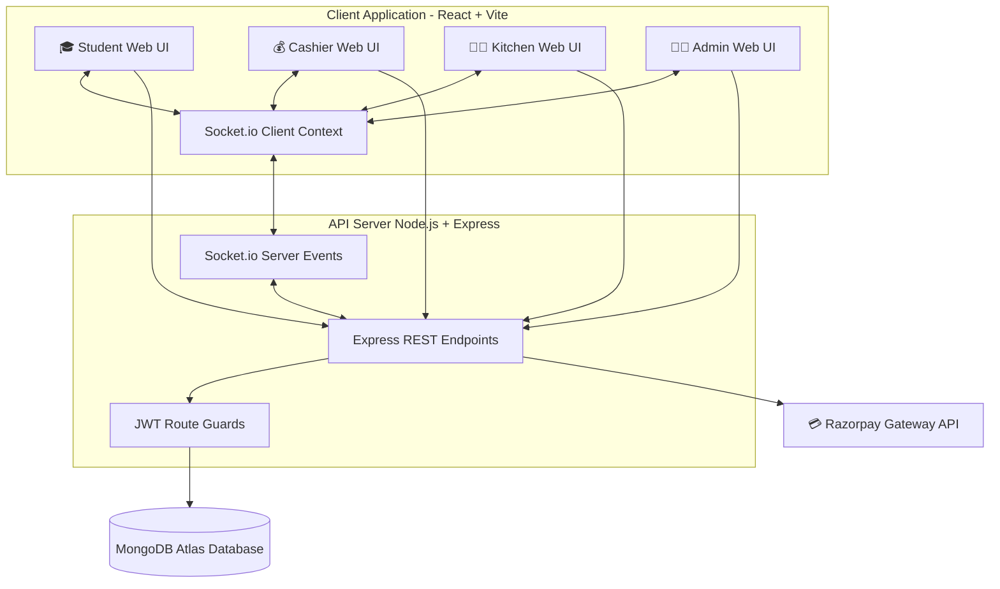
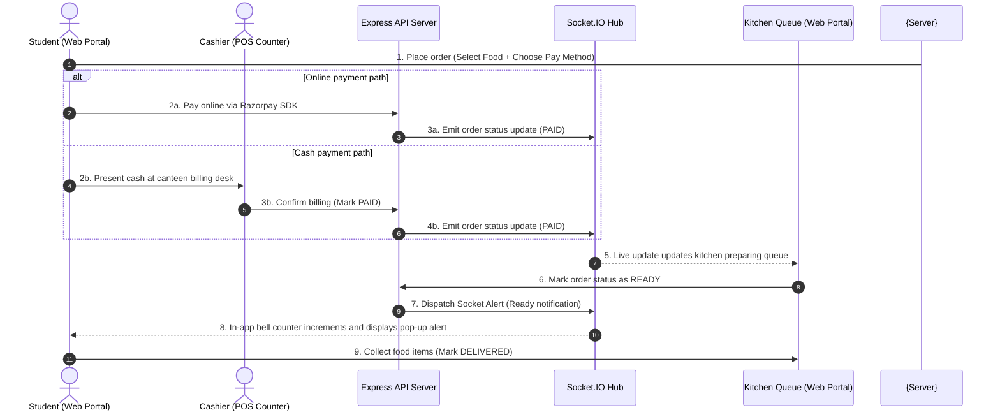

# SmartCanteen 🍽️

[](https://react.dev/)
[](https://vite.dev/)
[](https://tailwindcss.com/)
[](https://nodejs.org/)
[](https://expressjs.com/)
[](https://www.mongodb.com/)
[](https://socket.io/)
[](https://razorpay.com/)

A full-stack real-time canteen automation platform that streamlines food ordering, payment processing, kitchen operations, and order tracking through dedicated Student, Cashier, Kitchen, and Admin portals.

🔗 **Live Project Demo**: [smart-canteen-blush.vercel.app](https://smart-canteen-blush.vercel.app/)

---
## 👤 Demo Credentials

All seed accounts share the same default password:
* **Password**: `password123`

| Role | Username |
| :--- | :--- |
| **Canteen Admin** | `admin1` |
| **Counter Cashier** | `cashier1` |
| **Kitchen Crew** | `kitchen1` |
| **Student** | `22bd1a0501` |
| **Student** | `22bd1a0502` |

> [!NOTE]
> Demo credentials are provided for testing purposes only.

---

## 📋 Table of Contents
* [Problem Statement & Solution](#-problem-statement--solution)
* [Features Access Matrix](#-features-access-matrix)
* [Portal Breakdowns](#-portal-breakdowns)
* [Tech Stack](#-tech-stack)
* [System Architecture](#-system-architecture)
* [Project Workflow](#-project-workflow)
* [Installation & Local Setup](#-installation--local-setup)
* [API Specification](#-api-specification)
* [Demo Credentials](#-demo-credentials)
* [Key Highlights](#-key-highlights)
* [Future Enhancements](#-future-enhancements)
* [Author](#-author)

---

## 🎯 Problem Statement & Solution

### The Problem
Traditional college canteens rely on manual token-based ordering, resulting in long queues, crowding at the counters, payment delays, and inefficient order tracking. Kitchen staff struggle to manage orders chronologically, and students waste valuable break times waiting for their food.

### The Solution
**SmartCanteen** digitizes the entire canteen workflow. By implementing a real-time ordering and payment queue dashboard, cashiers can instantly log POS walk-ins, students can buy online or track statuses from their phones, and the kitchen manages a live, chronologically sorted preparation queue.

---

## 📊 Features Access Matrix

| Platform Features | Student | Cashier | Kitchen | Admin |
| :--- | :---: | :---: | :---: | :---: |
| Browse Menu & Cart | ✔ | | | |
| Place Order (Online/Cash) | ✔ | | | |
| Real-Time Order Status Tracking | ✔ | | | |
| Student Search (Roll/Phone) | | ✔ | | |
| Counter POS Ordering | | ✔ | | |
| Verify & Confirm Cash Payments | | ✔ | | |
| Preparing/Ready Order Queues | | | ✔ | |
| Update Orders (Ready/Delivered) | | | ✔ | |
| Catalog CRUD & Stock Management | | | | ✔ |
| Crew Staff Directory CRUD | | | | ✔ |
| Secure Password Reset Controls | | | | ✔ |
| Sales & Revenue Analytics Charts | | | | ✔ |

---

## 🌟 Portal Breakdowns

### 🎓 Student Portal
* **Registration & Login**: Secure signup/signin using hashed credentials.
* **Profile Management**: Profile page to update name, department, and phone details.
* **Menu Browsing**: Filter and browse items sorted by category with real-time stock indicators.
* **Cart Management**: Add, remove, and adjust item quantities with instant subtotal calculations.
* **Order Placement**: Place cash orders (verified at counter) or online orders.
* **Online Payments**: Direct sandbox verification using the Razorpay SDK.
* **Cash Payments**: Order placed instantly and processed upon cashier payment confirmation.
* **Order Tracking**: Live visual status card tracking active orders.
* **Real-Time Updates**: UI changes immediately as order status is adjusted.
* **In-App Notifications**: Website alert bell badge showing unread notification logs.
* **Order History**: History ledger to track previous purchases.

### 💰 Cashier Portal
* **Student Search**: Fast lookup of registered student profiles by Roll Number or Phone.
* **Counter Orders**: Billing POS layout to log walk-in orders.
* **Pending Payment Management**: List of cash-checkout orders waiting counter payment.
* **Mark Orders Paid**: Instant confirmation action moving orders from payment queue to the kitchen.
* **Transaction Logs**: Recent transaction records in a read-only list.

### 👨‍🍳 Kitchen Portal
* **Order Queue Management**: Chronological preparation queues sorting active orders.
* **Mark Orders Ready**: Moves card to collection queue and dispatches client-side socket notification.
* **Mark Orders Delivered**: Finalizes order processing and archives the order card.
* **Real-Time Order Updates**: Order cards appear, move, and disappear instantly as actions occur.

### 👨‍💼 Admin Portal
* **Menu Management**: CRUD catalog panel (add items, edit details, toggle active stock).
* **Staff Management**: View, register, and update cashier and kitchen worker accounts.
* **Password Reset Management**: Search student or staff profiles and generate secure, one-time temporary credentials.
* **Revenue Analytics**: Visual summary of today's gross sales, payments split, and pending balances.
* **Notification Analytics**: Logs of successfully pushed in-app and alert events.
* **Top Ordered Items**: Graph of top 5 best selling items by volume.

---

## 🛠️ Tech Stack

* **Frontend**: React.js, Vite, Tailwind CSS, Socket.IO Client
* **Backend**: Node.js, Express.js, Socket.IO
* **Database**: MongoDB, Mongoose
* **Authentication**: JWT, bcryptjs
* **Payments**: Razorpay
* **Deployment**: Vercel, MongoDB Atlas

---

## 🏗️ System Architecture



---

## 🔄 Project Workflow



---

## ⚙️ Installation & Local Setup

### 1. MongoDB Setup
Ensure you have MongoDB running locally, or configure a cluster on [MongoDB Atlas](https://www.mongodb.com/cloud/atlas) and obtain a cloud connection string.

### 2. Environment Configurations
Create a `.env` file inside the `server/` directory:
```env
PORT=5001
MONGO_URI=your_mongodb_connection_string
JWT_SECRET=your_jwt_secret_key_here
RAZORPAY_KEY_ID=your_razorpay_key_id_here
RAZORPAY_KEY_SECRET=your_razorpay_key_secret_here
```

### 3. Backend Installation
Navigate into the `server` directory, install packages, and seed default portal accounts:
```bash
cd server
npm install
npm run seed
```
Start the local server:
```bash
npm run dev
```

### 4. Frontend Installation
In a separate terminal tab at the root of the project, install packages and start the Vite client:
```bash
npm install
npm run dev
```
Open [http://localhost:5173](http://localhost:5173) in your browser.

---

## 🔌 API Specification

All protected endpoints require a JWT bearer token attached to headers: `Authorization: Bearer <token>`.

### Authentication APIs
* `POST /api/auth/student-register` (Public) - Create a student profile.
* `POST /api/auth/login` (Public) - Unified credentials login for all portals.
* `GET /api/auth/profile` (Protected) - Retrieves verified session user details.

### Student APIs
* `PUT /api/student/profile` (Protected, role: student) - Updates name, department, or phone.

### Menu Catalog APIs
* `GET /api/menu/student` (Protected) - Lists active/available menu items.
* `GET /api/menu/admin` (Protected, role: admin) - Lists full catalog items.
* `POST /api/menu/admin` (Protected, role: admin) - Add a new catalog food item.
* `PUT /api/menu/admin/:id` (Protected, role: admin) - Edit menu item details or stock toggle.
* `DELETE /api/menu/admin/:id` (Protected, role: admin) - Remove a food item.

### Order Management APIs
* `POST /api/orders/student` (Protected, role: student) - Checkout order.
* `GET /api/orders/student` (Protected, role: student) - Fetch current student history.
* `POST /api/orders/cashier` (Protected, role: cashier) - Counter POS checkout order.
* `GET /api/orders/cashier/pending` (Protected, role: cashier) - Get cash orders waiting payment.
* `PATCH /api/orders/cashier/:id/mark-paid` (Protected, role: cashier) - Set cash order status to PAID.
* `GET /api/orders/kitchen` (Protected, role: kitchen) - Active preparing & ready queue logs.
* `PATCH /api/orders/kitchen/:id/ready` (Protected, role: kitchen) - Set status to READY.
* `PATCH /api/orders/kitchen/:id/delivered` (Protected, role: kitchen) - Set status to DELIVERED.

### Administrative Management APIs
* `GET /api/admin/analytics` (Protected, role: admin) - Live analytics aggregate payload.
* `GET /api/admin/staff` (Protected, role: admin) - List registered cashiers and kitchen staff.
* `POST /api/admin/staff/create` (Protected, role: admin) - Register cashier/kitchen worker.
* `PUT /api/admin/staff/:id` (Protected, role: admin) - Edit staff account properties.
* `GET /api/admin/password-reset/search` (Protected, role: admin) - Find profile by roll number.
* `POST /api/admin/password-reset/reset` (Protected, role: admin) - Triggers reset of credentials.
* `GET /api/admin/password-reset/logs` (Protected, role: admin) - List password reset logs.

---

## ⚙️ Deployment Instructions

### MongoDB Atlas Cloud Cluster
1. Create a free shared cluster in Atlas.
2. In **Network Access**, click **Add IP Address** and whitelist `0.0.0.0/0` (Allow access from anywhere).
3. Under **Database Access**, create a database user and copy the connection string.

### Backend (Render / Alternative Node Hosts)
1. Deploy the project as a Node.js web service.
2. Configure **Root Directory** as `server`.
3. Set the build command to `npm install` and the start command to `node server.js`.
4. Add environment variables under advanced configurations.

### Frontend (Vercel)
1. Import your project directory to Vercel (auto-detects the Vite preset).
2. Add the environment variable `VITE_API_URL` pointing to your deployed backend URL.
3. Deploy!

---

## 💎 Key Highlights

* **Multi-Portal Architecture**: Tailored, isolated user experiences for students, cashier counter staff, kitchen preparing staff, and administrative management.
* **Real-Time Order Tracking**: Bi-directional communication channel keeps queues synchronized instantly across cashier confirmations and kitchen ready alerts.
* **Razorpay Integration**: Clean, verified online checkout flow validating payments before dispatching tickets to the kitchen.
* **Role-Based Authentication**: Custom Express middleware validates routing, preventing users from accessing administrative or kitchen dashboard panels.
* **Staff Management**: Administrative overview allowing full control over register logins, profile edits, and cashier directories.
* **Analytics Dashboard**: Tracks today's gross sales revenue, online/cash breakdown ratios, notifications history, and top-selling food rankings.
* **Secure REST APIs**: Complete parameter sanitation and secure password logging mechanisms that hide generated secrets behind hashes.

---

## 🔮 Future Enhancements

* **WhatsApp Cloud API Notifications**: Automatic SMS message delivery to students' registered phones as soon as orders are marked READY by the kitchen.
* **AI-Based Sales Forecasting**: Smart analytics module evaluating historical weekly sales to predict future daily inventory needs.
* **Inventory Management**: Automatically tracks and subtracts raw ingredient pools as orders are delivered, alerting admins to re-order supplies.
* **QR Pickup System**: Generate unique, scan-to-claim QR codes on the student UI that kitchen staff scan to verify pickup.
* **Mobile Application**: Wrap frontend builds inside React Native or progressive offline web containers for a mobile app store release.
* **Advanced Analytics**: Detailed charts supporting custom dates, monthly profit logs, and custom PDF receipt outputs.

---

## ✍️ Author

**Sai Charan Ega**

* **GitHub**: [github.com/saicharanega](https://github.com/saicharanega)
* **LinkedIn**: [linkedin.com/in/saicharanega](https://www.linkedin.com/in/saicharanega)
