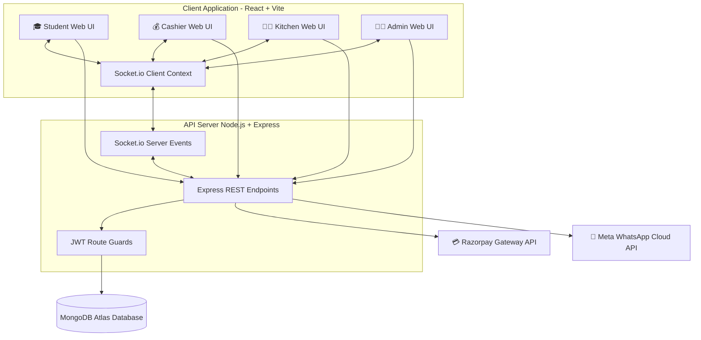
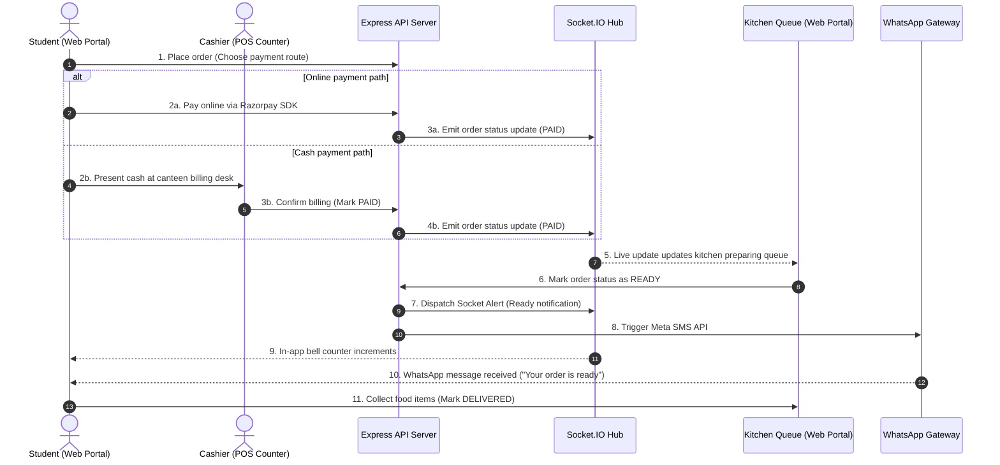

# SmartCanteen 🍽️

[](https://react.dev/)
[](https://vite.dev/)
[](https://tailwindcss.com/)
[](https://nodejs.org/)
[](https://expressjs.com/)
[](https://www.mongodb.com/)
[](https://socket.io/)
[](https://razorpay.com/)

**SmartCanteen** is a production-ready, full-stack real-time canteen automation platform. It is designed to streamline food ordering, payment processing, kitchen queue management, and admin oversight through a unified, secure system comprising dedicated **Student**, **Cashier**, **Kitchen**, and **Admin** portals.

---

## 📖 Table of Contents
* [Features](#-features)
* [Tech Stack](#-tech-stack)
* [System Architecture](#-system-architecture)
* [Project Workflow](#-project-workflow)
* [Screenshots](#-screenshots)
* [Installation & Local Setup](#-installation--local-setup)
* [API Specification](#-api-specification)
* [Demo Credentials](#-demo-credentials)
* [Key Highlights](#-key-highlights)
* [Future Enhancements](#-future-enhancements)
* [Author](#-author)

---

## 🌟 Features

### 🎓 Student Portal
* **Student Registration & Login**: Secure credential-based signup and signin utilizing cryptographically hashed passwords.
* **Profile Management**: Profile page to update full name, department, and phone details while keeping roll numbers and system roles read-only.
* **Browse Menu**: Interactive menu catalog showing items sorted by category (*Beverages*, *Snacks*, *Fast Food*) with live stock indicator states.
* **Add to Cart**: Dynamic cart management allowing item addition, removal, and quantity adjustments with instant checkout totals.
* **Place Orders**: Unified checkout supporting cash and online routes.
* **Online Payments (Razorpay)**: Sandbox integration with Razorpay SDK validating payment creation signatures on the backend.
* **Cash Payments**: Place orders marked pending until counter cash validation.
* **Order Tracking**: Chronological view tracking active orders categorized by statuses (`PENDING_PAYMENT`, `PAID`, `READY`, `DELIVERED`).
* **Real-Time Updates**: Instantly transitions order cards on the UI via socket events.
* **Notification Center**: Bell dropdown component displaying unread website alerts with support to mark single or all as read.

### 💰 Cashier Portal
* **Student Search**: Fast lookup of registered student profiles by Roll Number or Phone.
* **Counter Orders**: Direct POS cashier ordering layout to place on-the-spot orders for walk-ins or students.
* **Pending Payment Management**: List of orders awaiting cash payments at the counter.
* **Mark Orders Paid**: Click-to-pay confirmations syncing status modifications instantly with the kitchen screen.
* **Transaction Logs**: Read-only ledger showing recent cashier-handled orders.

### 👨‍🍳 Kitchen Portal
* **Order Queue Management**: Oldest-first queues displaying active orders in `PAID` (preparing) and `READY` (waiting collection) states.
* **Mark Orders Ready**: Transitions order state to `READY`, automatically pushing Socket.io in-app alerts and WhatsApp SMS updates to the customer.
* **Mark Orders Delivered**: Instantly archives the card to completed logs.
* **Real-Time Order Updates**: Kitchen queues expand/contract dynamically as new orders are processed at the counter or online.

### 👨‍💼 Admin Portal
* **Menu Management**: CRUD panel to add, edit, or delete items and toggle item availability on the fly.
* **Staff Management**: View, register, and update cashiers and kitchen worker accounts.
* **Password Reset Management**: Look up any student or staff profile and generate temporary credentials with secure one-time-view UI displays.
* **Revenue Analytics**: Admin dashboard displaying today's total orders, total revenue, online vs. cash splits, and cashier pending amounts.
* **Notification Analytics**: Track real-time success/failure tallies of outbound WhatsApp logs and website alerts.
* **Top Ordered Items**: Dynamically ranks and graphs the top 5 highest selling catalog items by volume and revenue.

---

## 🛠️ Tech Stack

### Frontend
* **Core Framework**: React.js (v19)
* **Build Tooling**: Vite
* **Styling**: Tailwind CSS
* **Icons**: Lucide React
* **Real-Time Engine**: Socket.IO Client (v4)

### Backend
* **Core Engine**: Node.js & Express.js
* **Real-Time Gateway**: Socket.IO Server (v4)
* **Authentication**: JSON Web Token (JWT) & bcryptjs (password hashing)
* **Payment Gateway**: Razorpay Node.js SDK
* **Notification Dispatcher**: Meta WhatsApp Cloud API (Graph API integration)

### Database
* **Database**: MongoDB (hosted securely via MongoDB Atlas)
* **ODM Client**: Mongoose

---

## 🏗️ System Architecture

The following diagram illustrates how the four portals communicate with the Express backend, Socket server, database, and third-party integrations:



---

## 🔄 Project Workflow

The step-by-step lifecycle of an order from placement to final collection:



---

## 📸 Screenshots

*To view live UI assets, replace the placeholders below after uploading your application visuals:*

| View | Screenshot |
| :--- | :--- |
| **Landing Page** |  |
| **Student Dashboard** |  |
| **Cart Page** |  |
| **Cashier Dashboard** |  |
| **Kitchen Dashboard** |  |
| **Admin Dashboard** |  |
| **Analytics Dashboard** |  |

---

## ⚙️ Installation & Local Setup

### Prerequisite Environment Checklist
Ensure you have **Node.js (v18+)** and **MongoDB** running locally or a **MongoDB Atlas Cloud Connection string** ready.

### 1. Database Configuration
Create a `.env` file in the `server` directory and paste your configuration:
```env
PORT=5001
MONGO_URI=mongodb+srv://<username>:<password>@<your-cluster>.mongodb.net/smartcanteen?retryWrites=true&w=majority
JWT_SECRET=your_super_secret_jwt_key_here
RAZORPAY_KEY_ID=rzp_test_SvEakfjU8iW6tS
RAZORPAY_KEY_SECRET=xqsC2iIuhP6AnwRVaAYQqmGY
WHATSAPP_API_KEY=your_whatsapp_cloud_api_access_token_here
WHATSAPP_PHONE_NUMBER_ID=your_whatsapp_phone_number_id_here
```

### 2. Backend Setup & Seeding
1. Open a terminal, go to the server folder, and install backend packages:
   ```bash
   cd server
   npm install
   ```
2. Seed the database with default accounts (users, students, and menu):
   ```bash
   npm run seed
   ```
3. Start the Node.js/Express server:
   ```bash
   npm run dev
   ```

### 3. Frontend Setup
1. Open a new terminal tab at the root of the project.
2. Install frontend dependencies:
   ```bash
   npm install
   ```
3. Boot up the Vite client:
   ```bash
   npm run dev
   ```
4. Access the portal at [http://localhost:5173](http://localhost:5173).

---

## 🔌 API Specification

All protected routes require a Bearer JWT Token in the Authorization header: `Authorization: Bearer <JWT_TOKEN>`.

### Authentication APIs
* `POST /api/auth/student-register` (Public) - Create student account.
* `POST /api/auth/login` (Public) - Standard login for all roles.
* `GET /api/auth/profile` (Protected) - Retrieves verified account credentials.

### Student APIs
* `PUT /api/student/profile` (Protected, role: student) - Updates name, phone, or department.

### Menu Catalog APIs
* `GET /api/menu/student` (Protected) - Fetches in-stock items.
* `GET /api/menu/admin` (Protected, role: admin) - Fetches full items.
* `POST /api/menu/admin` (Protected, role: admin) - Add menu item.
* `PUT /api/menu/admin/:id` (Protected, role: admin) - Edit menu item.
* `DELETE /api/menu/admin/:id` (Protected, role: admin) - Delete menu item.

### Order APIs
* `POST /api/orders/student` (Protected, role: student) - Places checkout cart order.
* `GET /api/orders/student` (Protected, role: student) - Customer history listing.
* `POST /api/orders/cashier` (Protected, role: cashier) - POS counter checkout.
* `GET /api/orders/cashier/pending` (Protected, role: cashier) - Cash orders waiting counters verification.
* `PATCH /api/orders/cashier/:id/mark-paid` (Protected, role: cashier) - Confirm cash payment.
* `GET /api/orders/kitchen` (Protected, role: kitchen) - Active kitchen queue.
* `PATCH /api/orders/kitchen/:id/ready` (Protected, role: kitchen) - Updates order to ready.
* `PATCH /api/orders/kitchen/:id/delivered` (Protected, role: kitchen) - Completes delivery.

### Administrative Management APIs
* `GET /api/admin/analytics` (Protected, role: admin) - Get aggregated analytics.
* `GET /api/admin/staff` (Protected, role: admin) - List cashier/kitchen users.
* `POST /api/admin/staff/create` (Protected, role: admin) - Add cashier/kitchen worker.
* `PUT /api/admin/staff/:id` (Protected, role: admin) - Update staff details.
* `GET /api/admin/password-reset/search` (Protected, role: admin) - Search profile by roll/username.
* `POST /api/admin/password-reset/reset` (Protected, role: admin) - Re-generate temp passwords.
* `GET /api/admin/password-reset/logs` (Protected, role: admin) - Fetch audit log table.

---

## 👤 Demo Credentials

Test accounts are preloaded into the database by the seeding script.
* **Shared Password for All Accounts**: `password123`

| Role | Username | Display Name |
| :--- | :--- | :--- |
| **Canteen Admin** | `admin1` | Canteen Admin 1 |
| **Counter Cashier** | `cashier1` | Canteen Cashier 1 |
| **Kitchen Crew** | `kitchen1` | Canteen Kitchen 1 |
| **Student** | `22bd1a0501` | Sai Charan Ega |
| **Student** | `22bd1a0502` | Priya Sharma |

> [!NOTE]
> **Safety Warning**: Demo credentials are provided for testing purposes only.

---

## 💎 Key Highlights

* **Real-Time Order Tracking**: Integrates Socket.io to keep portals synchronized. When kitchen updates an order status, the cashier and student pages update instantly without requiring page reloads.
* **Razorpay Payment Gateway**: Secure frontend payment flow checking and validating payment signature verify logs before confirming database updates.
* **Role-Based Authentication**: Strict JWT verification middleware guards all critical routes. Students are blocked from access level permissions to staff pages.
* **WhatsApp Outbound Notifications**: Direct connection to Meta's Cloud Graph API dispatches SMS notifications to students' registered phones.
* **Multi-Portal Architecture**: Tailored interfaces for student mobile ordering, cashier walk-in billing, kitchen prep queues, and admin financials.
* **Audit Password Reset Ledger**: Passwords generated by the administrator are never saved in logs as plaintext. They display once on-screen and are saved as secure bcrypt hashes.

---

## 🔮 Future Enhancements

* **AI Canteen Sales Forecasting**: Integrate forecasting libraries to analyze order volumes and predict item demand based on days of the week or college seasons.
* **Inventory Management Module**: Deducts raw ingredients count dynamically as kitchen staff complete food orders, flagging low stock items to the admin.
* **Mobile Companion Application**: Deploying client files as a Progressive Web App (PWA) with push notification alerts.
* **QR Code Pickup System**: Generates secure pickup QR slips on students' tracking dashboards that kitchen workers scan using a camera view to verify collection.
* **Advanced Financials Export**: PDF/CSV invoice exports showing monthly canteen financials and tax records.

---

## ✍️ Author

**Sai Charan Ega**
* GitHub: [github.com/saicharanega](https://github.com/saicharanega)
* LinkedIn: [linkedin.com/in/saicharanega](https://www.linkedin.com/in/saicharanega)
